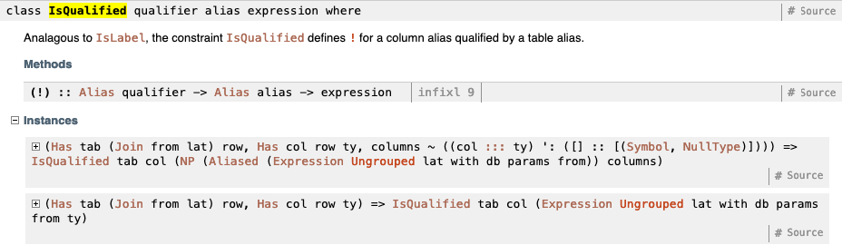
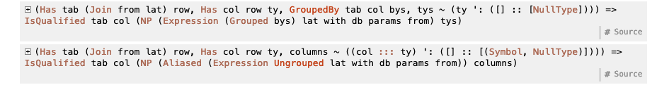
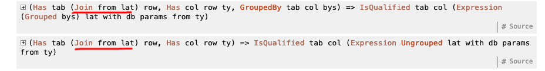

# Squeal Core Concepts Handbook

This handbook isn't intended as a comprehensive reference to Squeal; that's what
the Haddock is for. Instead, this is meant to give you an understanding of the
fundamental parts of Squeal: its core types and typeclasses, as well as its
heavy use of phantom types. Once you understand these, which are the most
complicated part of learning to use Squeal, you should have a solid base to
figure out everything else.

At its core, you can view Squeal as a small group of easy-to-understand types
(`Query`, `Manipulation`, `Statement`, `Expression`, `FromClause`, and
`TableExpression`) that have hard-to-understand type parameters (`Expression
grouping lat with db params from ty`). The former map to your existing
understanding of SQL in a fairly obvious way; the latter make sure that your
queries are actually valid.

We can get our first, most basic understanding of Squeal by ignoring the type
parameters entirely and looking specifically at those core types.

## Squeal's Core Types

Imagine, if you would, a world where we only had those six types above, with no
type parameters attached to them.

That would be possible, right? And you can see how they could fit together to
form larger queries. That gives us the composability we wanted.

[`Query`](https://hackage.haskell.org/package/squeal-postgresql-0.7.0.1/docs/Squeal-PostgreSQL-Query.html#t:Query) and [`Manipulation`](https://hackage.haskell.org/package/squeal-postgresql-0.7.0.1/docs/Squeal-PostgreSQL-Manipulation.html#t:Manipulation)
line up cleanly with what we expect a SQL query to look like, so let's start by
looking at those two types.

`Query`s represent mainly SQL **SELECT**. `Manipulation`s represent **UPDATE**,
**INSERT INTO**, and **DELETE FROM**.

```haskell
query = select
  (List $ #u ! #name `as` #userName :* #e ! #email `as` #userEmail)
  ( from (table (#users `as` #u)
  & innerJoin (table (#emails `as` #e))
    (#u ! #id .== #e ! #user_id)) )
```

`Query`s have two parts, the description of the columns selected, and the
`TableExpression` that describes where to select those columns from.

```text
query = select

  (List $ #u ! #name `as` #userName          } the column selection
       :* #e ! #email `as` #userEmail)       }

  ( from (table (#users `as` #u)             }
  & innerJoin (table (#emails `as` #e))      } the TableExpression
    (#u ! #id .== #e ! #user_id)) )          }
```

A [`TableExpression`](https://hackage.haskell.org/package/squeal-postgresql-0.7.0.1/docs/Squeal-PostgreSQL-Query-Table.html#t:TableExpression)
is generated from a [`FromClause`](https://hackage.haskell.org/package/squeal-postgresql-0.7.0.1/docs/Squeal-PostgreSQL-Query-From.html#t:FromClause),
which only describes the joins. You convert a `FromClause` to a `TableExpression` using `from`. Once you
have a TableExpression, that's where functions like [`where_`](https://hackage.haskell.org/package/squeal-postgresql-0.7.0.1/docs/Squeal-PostgreSQL-Query-Table.html#v:where_)
and [`having`](https://hackage.haskell.org/package/squeal-postgresql-0.7.0.1/docs/Squeal-PostgreSQL-Query-Table.html#v:having)
let you restrict the rows you get back.

```text
( from                                                     }
    ( table (#users `as` #u)            }                  }
    & innerJoin                         } a FromClause     } the whole thing is
       (table (#emails `as` #e))        }                  } a TableExpression
       (#u ! #id .== #e ! #user_id))    }                  }
& where_ ...                                               }
)                                                          }
```

Manipulations aren't particularly different from Querys. The one thing that
should be pointed out is that all of them specify a table using an `Aliased
(QualifiedAlias sch) (tab ::: tab0)`, and that UPDATE and DELETE have a
[`UsingClause`](https://hackage.haskell.org/package/squeal-postgresql-0.7.0.1/docs/Squeal-PostgreSQL-Manipulation.html#t:UsingClause)
instead of a `TableExpression` to specify additional joins. `UsingClause` specifically
takes a `FromClause`, to prevent you from doing things like putting `WHERE` or `HAVING` on them.

```haskell
manip = deleteFrom
  #users
  (Using (table #emails))
  (#users ! #id .== #emails ! #user_id)
  Returning_ Nil
```

Once you get into specifying the actual bits of data you care about, you're
primarily concerned with generating values of type [`Expression`](https://hackage.haskell.org/package/squeal-postgresql-0.7.0.1/docs/Squeal-PostgreSQL-Expression.html#t:Expression).
We're still ignoring most of the type parameters in Squeal's types, but in the case of
Expression the very last one, `ty`, is of interest to us.

```haskell
-- imagine a stripped-down version of Expression
data Expr ty

-- this is for teaching purposes; will not typecheck
foo :: Expr ('NotNull 'PGint4)
foo = #table ! #field1
```

You'll construct Expressions (and `Condition`, which is just an alias for
`Expression (null 'PGbool)`) everywhere.

The one last piece of the puzzle that we haven't explained yet: how do you
specify which columns in a Query that you're returning? How do you specify
which columns you're updating in an UPDATE Manipulation? The key here is the
[`NP`](https://hackage.haskell.org/package/squeal-postgresql-0.7.0.1/docs/Squeal-PostgreSQL-Type-List.html#t:NP)
type, which Squeal reexports from `generics-sop`. You'll see this type in a
lot of different places. It will also confuse the hell out of you the first time
you see it in documentation.

```haskell
selectedColumns :: NP '[ "userName" ::: 'NotNull 'PGtext, "userEmail" ::: 'Null 'PGtext ]
selectedColumns =
     #users ! #name `as` #userName
  :* #emails ! #email `as` #userEmail
```

It's a way for Squeal to have heterogeneous lists that also typecheck against the
DB schema. We'll talk about how that typechecking works later, once we
understand Squeal's type parameters. From a practical perspective, mainly
you need to know that you construct them using `(:*)`.

All of the types we've talked about so far live in "Postgres-land;" they only
know about Postgres types, and have no knowledge of how to translate those types
into actual in-memory Haskell data. That translation lives inside the
[`Statement`](https://hackage.haskell.org/package/squeal-postgresql-0.7.0.1/docs/Squeal-PostgreSQL-Type-List.html#t:NP)
type, which lives one level above Query and Manipulation. Both
Query and Manipulation can be converted to Statement by providing an encoder to
convert the query's params from Haskell types to Postgres types, and a decoder
to do the opposite for the query's results. We'll look at encoding and decoding
to/from PG later; just remember that conceptually the Statement type is there to
combine a raw query with an associated Haskell <=> PG codec.

Let's put all this together in a concrete example. Say we had the following
typical query:

```haskell
getUsers :: Statement DB () User
getUsers = query $ select
  (List $ #u ! #name `as` #userName :* #e ! #email `as` #userEmail)
  ( from (table (#users `as` #u)
    & innerJoin (table (#emails `as` #e))
      (#u ! #id .== #e ! #user_id)) )
```

Since all this is is an expression built out of the smaller types we've looked
at above, we can expand this out into its constituent parts and see just
how everything fits together. Ignore the amount of noise in the type
parameters; focus on the type heads like Query, Expression etc. that we
talked about.

```haskell
getUsersQuery :: Query with lat DB params '[ "userName" ::: 'NotNull 'PGtext, "userEmail" ::: 'Null 'PGtext ]
getUsersQuery =
  select
    (List getUsersSelection)
    ( from (table (#users `as` #u)
      & innerJoin (table (#emails `as` #e))
        (#u ! #id .== #e ! #user_id)) )

getUsersSelection :: NP (Aliased (Expression 'Ungrouped with lat DB params
  '[ "u" ::: '[ "id" ::: 'NotNull 'PGint4
              , "name" ::: 'NotNull 'PGtext
              ]
   , "e" ::: '[ "id" ::: 'NotNull 'PGint4
              , "user_id" ::: 'NotNull 'PGint4
              , "email" ::: 'Null 'PGtext
              ]
   ]))
   '[ "userName" ::: 'NotNull 'PGtext, "userEmail" ::: 'Null 'PGtext ]
getUsersSelection =
  #u ! #name `as` #userName :* #e ! #email `as` #userEmail

getUsersFrom :: TableExpression 'Ungrouped lat with DB params
  '[ "u" ::: '[ "id" ::: 'NotNull 'PGint4
              , "name" ::: 'NotNull 'PGtext
              ]
   , "e" ::: '[ "id" ::: 'NotNull 'PGint4
              , "user_id" ::: 'NotNull 'PGint4
              , "email" ::: 'Null 'PGtext
              ]
   ]
getUsersFrom =
  ( from (table (#users `as` #u)
  & innerJoin (table (#emails `as` #e))
      getUsersJoinExpr))

getUsersJoinExpr :: Expression 'Ungrouped lat with DB params
  (Join
     '[ "u" ::: '[ "id" ::: 'NotNull 'PGint4
                 , "name" ::: 'NotNull 'PGtext
                 ]
      ]
     '[ "e" ::: '[ "id" ::: 'NotNull 'PGint4
                 , "user_id" ::: 'NotNull 'PGint4
                 , "email" ::: 'Null 'PGtext
                 ]
      ])
  ('Null 'PGbool)
getUsersJoinExpr =
  #u ! #id .== #e ! #user_id
```

These definitions can be loaded into the REPL. You can try playing around with
them if you'd like to get a feel for how the types work. You'll need the
following DB schema type in scope:

```haskell
type UsersColumns =
  '[ "id"   :::   'Def :=> 'NotNull 'PGint4
   , "name" ::: 'NoDef :=> 'NotNull 'PGtext
   ]

type UsersConstraints = '[ "pk_users" ::: 'PrimaryKey '["id"] ]

type EmailsColumns =
  '[ "id" ::: 'Def :=> 'NotNull 'PGint4
   , "user_id" ::: 'NoDef :=> 'NotNull 'PGint4
   , "email" ::: 'NoDef :=> 'Null 'PGtext ]

type EmailsConstraints =
  '[ "pk_emails"  ::: 'PrimaryKey '["id"]
   , "fk_user_id" ::: 'ForeignKey '["user_id"] "public" "users" '["id"]
   ]

type Schema =
  '[ "users" ::: 'Table (UsersConstraints :=> UsersColumns)
   , "emails" ::: 'Table (EmailsConstraints :=> EmailsColumns)
   ]

type DB = Public Schema
```

## Where's the polymorphism? Actually constructing Expressions

So far we've been using `(!)` and `as` without really understanding them; we
just use them as if they're equivalent to SQL `.` and `AS`, and assuming that
they'll do the right thing.

But what's the actual type of this fragment?

```haskell
#some_table ! #yay
```

When we were writing simple queries, we didn't particularly have to care about
what type this is. But as we write more complicated queries and start to think
about making our queries more modular, we need to be able to express the types
of values like this.

For instance, depending on where you use it, it might be an Expression:

```haskell
foo :: Expression 'Ungrouped lat with db '[] '[ "some_table" ::: '[ "yay" ::: 'NotNull 'PGint4 ] ] ('NotNull 'PGint4)
foo = #some_table ! #yay
```

But it can also be an NP:

```haskell
bar :: NP (Expression 'Ungrouped lat with db '[] '[ "some_table" ::: '[ "yay" ::: 'NotNull 'PGint4 ] ]) '[ 'NotNull 'PGint4 ]
bar = #some_table ! #yay
```

It can even become a table name:

```haskell
baz :: Aliased (QualifiedAlias "some_table") ("yay" ::: "yay")
baz = #some_table ! #yay

fromClause :: FromClause lat with
  '[ "some_table" :::
     '[ "yay" ::: 'Table
        ('[] :=> '[ "a" ::: 'NoDef :=> 'NotNull 'PGint4 ])
      ]
   ]
  '[]
  '[ "yay" ::: '[ "a" ::: 'NotNull 'PGint4 ] ]
fromClause = table baz
```

The key here is that both `(!)` and `as` are polymorphic in their return
type. This polymorphism is key to making Squeal convenient to write, but it can
be very confusing when first starting to use the library, as it makes it hard to
understand how to construct a certain Squeal type. This misunderstanding seems
like a consequence of how we usually use polymorphic returns. Usually the
polymorphic return is on a function that does some kind of conversion or
processing; canonical examples are things like `read` from Base, or `fromJSON`
from Aeson. In Squeal, that type conversion happens when you *name* things. It
accomplishes the goal of embedded SQL in Haskell in a relatively easy-to-read
way, but it takes some getting used to.

What `(!)` can return is defined by the typeclass [`IsQualified`](https://hackage.haskell.org/package/squeal-postgresql-0.7.0.1/docs/Squeal-PostgreSQL-Type-Alias.html#t:IsQualified);
similarly, `as` uses a typeclass called [`Aliasable`](https://hackage.haskell.org/package/squeal-postgresql-0.7.0.1/docs/Squeal-PostgreSQL-Type-Alias.html#t:Aliasable).
If you squint through the mess of type parameter noise, you can see that this
is how certain types are constructed (for instance, our NP lists of expressions
in select lists, and expressions themselves):



and thus, how you can use `(!)` and `as` in so many places.

This is especially important around uses of NP and update lists; a common
mistake is writing something like this while doing SELECTs:

```haskell
select
  (List $
       #table ! #field1
    :* #table ! #field2
    :* Nil)
  (from ...)
```

But this final `Nil` is actually unnecessary! The NP cons operator `:*` takes
another NP as its second argument, which is why you might think you need Nil to
terminate the NP list. But if you look at the instances of `IsQualified`, it can
polymorphically return an NP already!



So we can simplify our definition a bit:

```haskell
-- this typechecks
select
  (List $
       -- note that these two lines have different types
       (#table ! #field1 :: Aliased (Expression _ _ _ _ _) _)
    :* (#table ! #field2 :: NP (Aliased (Expression _ _ _ _ _) _)))
  (from ...)
```

We'll see later that this is also Squeal's preferred way to handle things like
CTEs.

What does all this mean for us? It gives us the type signatures we'd need when
we want to, say, have a common query that's parameterized by a table name, or a
query that needs to be parameterized by which column to run a WHERE on. For
instance, for a table name as a parameter, we'd want an `Aliased (QualifiedAlias
sch) tab`, since that's the parameter for `table`. We can then be assured that
callers can construct values of this type, since we can see an instance for
`IsQualified` for it.


Following the typeclasses, we see that we can do something similar for
Expression, since there are instances for `IsQualified` and `Aliasable` for
generating Expressions as well.

If you wanted to be completely general and allow a Squeal identifier to be used
in, say, both an expression and table name position, you could use the
IsQualified and Aliasable constraints directly. In general this doesn't seem to
be very useful though.

One last thing is that while the return type of `(!)` is polymorphic, its
arguments are not; it takes two [`Alias`](https://hackage.haskell.org/package/squeal-postgresql-0.7.0.1/docs/Squeal-PostgreSQL-Type-Alias.html#t:Alias)es, which are essentially renamed
`Proxy`'s. Since you can also generate Aliases from labels like `#table`, this
provides another avenue you can use to make your queries more general and
modular; take in Aliases as parameters and use `(!)` to convert to the type you
need on-demand.

## Squeal's type parameters

It's finally time to talk about the heart and soul of Squeal, what makes it
tick: the plethora of type parameters on all of its core types.

This is where Squeal handles the heavy lifting of ensuring that all of your
queries are well-formed, that they reference columns that actually exist, that
your SQL comparisons are well-typed, that the columns that you insert as DEFAULT
actually have default values, and so on.

To refresh your memory, here's the full type signature of `Expression`, in all of
its phantomly-typed glory:

```haskell
newtype Expression grp lat with db params from ty
```

One quick note before we dive into these. Throughout Squeal you'll see the
type operator `(:::)`. For instance, Squeal uses type-level specifications of
table columns that look like so:

```haskell
type Columns =
  '[ "col1" ::: 'NotNull 'PGbool
   , "col2" ::: 'NotNull 'PGint4
   ]
```

In the Squeal ecosystem, this essentially means "type of." Note that it's *3*
colons, not 2 like for normal type signatures. Underneath the hood, `(:::)` is
just an alias for type-level tuples, so the above type is equivalent to the
following:

```haskell
type Columns =
  '[ '("col1", 'NotNull 'PGbool)
   , '("col2", 'NotNull 'PGint4)
   ]
```

With that out of the way, let's go through Squeal's type parameters one-by-one,
shall we?

### `grp`

In SQL, an expression is either a "normal" value or an aggregate value. You probably
already understand this intuitively, even if you never put a name on it. For
instance, let's say you wrote a query like the following:

```SQL
CREATE TABLE foo
  ( user_id INT4 NOT NULL
  , value INT4 NOT NULL
  );

SELECT user_id, SUM(value)
  FROM foo
 GROUP BY user_id;
```

In the select list of the above query, `user_id` and `SUM(value)` are both
"aggregate" values; **user_id** because it's included in the GROUP BY, and
**SUM(value)** since it's directly calling an aggregate function.

If we don't call any aggregating functions or do a GROUP BY, we have "normal"
values instead:

```SQL
SELECT user_id, value
  FROM foo;
```

It's important to understand the distinction, because you can't mix normal and
aggregate values in the same query:

```SQL
SELECT user_id, SUM(value)
  FROM foo;

-- ERROR:  column "foo.user_id" must appear in the GROUP BY clause or be used in an aggregate function
-- LINE 1: SELECT user_id, SUM(value)
```

Postgres barfs, because SUM constrains it to only produce one row, but then what
should the `user_id` of that row be? The complicated part is that an identifier
like `user_id` could be either a normal or an aggregate value, depending on the
surrounding context. So Squeal is obligated to keep track of whether an
expression was generated from an aggregate function or is part of the GROUP BY,
which it does using the `grp` type parameter on an Expression.

It can either be `'Ungrouped`, meaning a normal value, or `'Grouped bys`, which
indicates that Expression is valid in any context where the columns `bys` are
grouped.

For instance, selecting `#table ! #field1` in an aggregated context
would want a type like `Expression ('Grouped '[ "table" ::: "field1" ]) ...`,
indicating that this selection isn't valid without that field grouped. Calling
a function like Squeal's [`count`](https://hackage.haskell.org/package/squeal-postgresql-0.7.0.1/docs/Squeal-PostgreSQL-Expression-Aggregate.html#v:count)
would return a type like `Expression ('Grouped bys) ...`, where the type variable
being abstract means that it doesn't care *what* columns the query is grouped by,
just that it's grouped in *some* way.

However, if you use an aggregate function, the query *does* have to be grouped,
which can cause a confusing error the first time you see it. If you're used
to writing things like `SELECT COUNT(id) FROM ...` in SQL, you might try to
naively translate this into Squeal like so:

```haskell
foo :: Query lat with
  '[ "public" :::
     '[ "table" ::: 'Table
        ('[] :=> '[ "id" ::: 'NoDef :=> 'NotNull 'PGint4 ])
      ]
   ]
  '[]
  '[ "a" ::: 'NotNull 'PGint8 ]
foo = select
  (count (All $ #table ! #id) `as` #a)
  (from (table #table))
```

Which will promptly fail with a type error:

```haskell
    • No instance for (Aggregate AggregateArg (Expression 'Ungrouped))
        arising from a use of ‘count’
    • In the first argument of ‘as’, namely
        ‘count (All $ #table ! #id)’
      In the first argument of ‘select’, namely
        ‘(count (All $ #table ! #id) `as` #a)’
      In the expression:
        select (count (All $ #table ! #id) `as` #a) (from (table #table))
```

What this is *essentially* telling you is that you forgot to group your query,
which you need to do **even if you're running your aggregate on all rows**. We
do this by explicitly telling Squeal to group on no columns, which is one of the
few legitimate uses of `Nil`:

```haskell
foo :: Query lat with
  '[ "public" :::
     '[ "table" ::: 'Table
        ('[] :=> '[ "id" ::: 'NoDef :=> 'NotNull 'PGint4 ])
      ]
   ]
  '[]
  '[ "a" ::: 'NotNull 'PGint8 ]
foo = select
  (count (All $ #table ! #id) `as` #a)
  ( from (table #table)
  & groupBy Nil  -- group by nothing!
  )
```

You will mess this up at least 2 times.

### `from`

When a column is specified in the selection list, how do you know when it's
valid? This may seem like a silly question, but consider the following
(stupid) query:

```SQL
SELECT bar.id FROM foo;
```

No one would write a query like this. Syntactically it seems fine. But it's
nonsense, because we haven't pulled in the `bar` table to our query! And
Postgres agrees with us.

```
ERROR:  missing FROM-clause entry for table "bar"
LINE 1: SELECT bar.id
```

Every query creates a *scope* for identifiers, separate from the database scope
of table names and schemas, and each join adds a new name to this scope. This is
plain to see if we use AS to rename a table that we pull in.

```haskell
SELECT f.user_id FROM foo AS f;
-- ok

SELECT foo.user_id FROM foo AS f;
-- ERROR:  invalid reference to FROM-clause entry for table "foo"
-- LINE 1: SELECT foo.user_id FROM foo AS f;
```

The name `f` is only in scope for this query. Even when you *don't* specify
an alias in the SQL, it works as if you had specified the alias as the table's
name, which we can see since the latter query gets rejected by Postgres.

In order to figure out whether identifiers like `#table ! #field` are valid,
Squeal needs to track this scope as well. It does so using the `from` type
variable.

In fact, this type variable is all you need to write standalone expressions.

```haskell
-- doesn't typecheck
badExpr :: Expression 'Ungrouped '[] with db params from ('NotNull 'PGint4)
badExpr = #table ! #field

-- does typecheck
goodExpr :: Expression 'Ungrouped '[] with db params
  '[ "table" ::: '[ "field" ::: 'NotNull 'PGint4 ] ]
  ('NotNull 'PGint4)
goodExpr = #table ! #field
```

Whenever you create an expression by referring to a column by name, it's this
scope inside the `from` type variable that Squeal checks to ensure that the
reference is valid. If you're getting `HasErr` constraint violations, it's
likely that the contents of this variable aren't in the right form.

The only way to add things to `from` is by using joins. If you look at the type
signature of the various join functions that Squeal provides, they take an
existing `FromClause` and add an extra table to it.

```haskell
table
  :: (Has sch db schema, Has tab schema (Table table))
  => Aliased (QualifiedAlias sch) (alias ::: tab)
  -> FromClause lat with db params '[alias ::: TableToRow table]
     -- `table` (and `view`, `common`, `subquery`) produce a FromClause
     -- containing a single set of columns...

innerJoin
  :: FromClause lat with db params right
  -> Condition Ungrouped lat with db params (Join left right)
  -> FromClause lat with db params left
  -> FromClause lat with db params (Join left right)
     -- ...which the join functions append to the tables already in `from`
```

For a more complicated query, here's what the value of `from` may end up
looking like:

```haskell
type QueryFrom =
  '[ "table1" :::
     '[ "id" ::: 'NotNull 'PGuuid
      , "field1" ::: 'Null 'PGint4
      , "field2" ::: 'NotNull 'PGtext
      ]
   , "table2" :::
     '[ "id" ::: 'NotNull 'PGuuid
      , "field1" ::: 'NotNull 'PGbool
      ]
   , "table3" :::
     '[ "id" ::: 'NotNull 'PGuuid
      , "table2_id" ::: 'NotNull 'PGuuid
      , "created_at" ::: 'NotNull 'PGtimestamptz
      ]
   ]

type DB = -- ... some schema with the appropriate tables ...

froms :: FromClause lat with DB params QueryFrom
froms =
  ( table (#table1 `as` #table1)
  & innerJoin (table (#table2 `as` #table2))
      (#table2 ! #id .== #table1 ! #id)
  & innerJoin (table #table3)
      (#table3 ! #table2_id .== #table2 ! #id)
  )
```

Note that the order of tables in `from` needs to be the same order in which they
were joined.

Explicitly providing a type alias for which tables a query has access to
like this is often useful, especially when you want to allow callers of your
query to pass in custom expressions. For instance, if you wanted to allow
callers to pass in a filtering condition, you could do that by ensuring that
the `from` in the passed-in Expression is valid for the tables that the query
joins on.

```haskell
parameterized ::
     Expression 'Ungrouped lat with db params QueryFrom ('NotNull 'PGbool)
  -> Query lat with db params '[ "a" ::: 'NotNull 'PGint4 ]
parameterized cond =
  select
    (#table1 ! #field1)
    ( from froms
    & where_ cond
    )
```

Then, as you'd expect, any callsite could use any columns specified in that
query scope, while rejecting any references that aren't in scope.

```haskell
-- these typecheck
qry1 = parameterized (#table1 ! #field2 .== "mobile")
qry2 = parameterized (#table2 ! #field1)

-- these don't
qry3 = parameterized (#table4 ! #id .== "SimSpace")
qry4 = parameterized (#table1 ! #nonfield)
```

Note the "flow" of type-level data going on here: we start off with existing
table definitions in `db`, which get pulled into the value of `from` by using
`innerJoin`, `leftOuterJoin`, etc. Once `from` has the right type-level value,
now expressions like `#table1 ! #field2` will satisfy their `IsQualified`
constraint and typecheck.

### `lat`

Remember when I said that `from` was the only place that Squeal looked when
it was checking whether column references were valid? That was a slight lie.
Squeal actually checks one other place, the `lat` type param.

You can see this in the various IsQualified instances for Expression, Aliased Expression,
etc.



Other than joins, there's one other place where identifiers can come into scope
for a query: a Postgres-specific feature called lateral joins. If you've used
Microsoft SQL Server before, you might know these as CROSS APPLYs, but if not,
it's totally understandable if you've never seen a lateral join before.

To understand what a lateral join does, it's helpful to compare it to a normal
subquery join. When you do a normal subquery join, the subquery is a completely
different query from the one it's being joined into, which means that the subquery
can't access anything that's in scope from the parent query.

```SQL
SELECT *
  FROM some_table st
  JOIN (SELECT * FROM some_other_table sot WHERE st.id = sot.table_id)
    -- error: st is not in scope in the subquery
```

But sometimes having those values in scope would be extremely useful. Say you
have a table for your users, and another table containing login events.

```SQL
CREATE TABLE "user"
  ( id SERIAL PRIMARY KEY NOT NULL
  , username TEXT NOT NULL
  , email TEXT NOT NULL
  , created_at TIMESTAMPTZ NOT NULL
  );

CREATE TABLE "login_event"
  ( user_id INT4 NOT NULL REFERENCES "user" (id)
  , source TEXT NOT NULL  -- web|mobile|embed
  , timestamp TIMESTAMPTZ NOT NULL
  );
```

How would you write a query to get, for each user, the latest login, including
all the username/email information, and the source information? It's possible
using normal subqueries, albeit somewhat painful to write. If you don't believe
me, stop reading and try writing a raw SQL query to get this data.

Lateral joins give you a more convenient way to write "dependent" queries like
this. They act more like a "foreach" loop: Postgres will run the lateral
subquery for each row being joined to, and calculate separate sets of rows to
join with.

```SQL
SELECT u.id, u.username, u.email, u.created_at,
       le.source, le.timestamp
  FROM public.user AS u
  INNER JOIN LATERAL
    (SELECT le.source, le.timestamp
       FROM public.login_event AS le
      WHERE le.user_id = u.id
      ORDER BY le.timestamp DESC
      LIMIT 1) AS le
    ON TRUE;
```

Helpful, right? But since it's another way in which identifiers can come into
scope for a query, Squeal needs a way to represent it.

Structurally, `lat` looks exactly like `from`; it's a mapping of table
names to lists of columns and their types. You'll never have to worry about it
unless you're using lateral joins; Squeal provides explicit lateral versions
of all the normal join functions which are there if you need them. Since most
of the time you won't be using these, well...

### `db`

We saw in the discussion of `from` how that type parameter gets populated by
usages of functions like `innerJoin`, `leftOuterJoin`, and so on. But the
table types that get joined on have to *come* from `db`, which we can see
happening in the type signatures for `table` and `view`:

```haskell
table
  :: (Has sch db schema, Has tab schema (Table table))
  => Aliased (QualifiedAlias sch) (alias ::: tab)
  -> FromClause lat with db params '[alias ::: TableToRow table]

view
  :: (Has sch db schema, Has vw schema (View view))
  => Aliased (QualifiedAlias sch) (alias ::: vw)
  -> FromClause lat with db params '[alias ::: view]
```

It can be a little easier to see what's going on here if we have an explicit
DB type. Let's define one.

```haskell
type DB = '[ "public" ::: Schema ]

type Schema = '[ "users" ::: Table UsersTable ]

type UsersTable =
  '[] :=> '[ "id" ::: 'NotNull 'PGuuid ]

-- using our new type
table (#public ! #users)
```

Walk through the constraints being discharged: the first `Has sch db schema`
becomes `Has "public" DB schema`, checking whether the "public" schema exists
within our database type. The second `Has` becomes `Has "users" schema (Table table)`,
checking whether there's a correctly named table within the schema found by
the first constraint. Once those constraints are discharged, the compiler
is happy to give us a `FromClause` which we can use in our joins and queries,
thus bringing columns into scope.

That's all `db` is: a type-level tree structure representing your entire
database schema, such that downstream code can figure out what tables and
columns exists, and thus, whether your queries are reasonable. You can think
of it as the source of truth about column types that everything starts from.

In practice most of the compilation errors you encounter won't be caused by your
`db` type. It's not usually a go-to type parameter to put constraints on for
abstraction, either. Squeal does not provide any functionality for keeping
your top-level DB type definition in sync with your actual Postgres schema,
however. Ensuring that your DB type reflects reality is your responsibility.

### `with`

You've probably seen SQL queries of the form `WITH <subquery> AS <name> SELECT ...`,
like a let-binding but for a subquery. Squeal has support for these sorts of
queries as well, using the [`with`](https://hackage.haskell.org/package/squeal-postgresql-0.7.0.1/docs/Squeal-PostgreSQL-Query-With.html#v:with) function.

```haskell
qry :: Query lat with DB params '[ "a" ::: 'NotNull 'PGbool ]
qry = with
  (select (true `as` #a) (from (table #users)) `as` #cte)
  (select Star
    (from (common #cte)))  -- note the use of `common` to bring the CTE into scope
                           -- for this query
```

Since these subqueries are scoped to each individual query, Squeal needs some
way of keeping track of them so that it can check that usages of `common` are
valid. As you might guess, that storage is happening in the `with` type
parameter.

```haskell
with
    ( select (true `as` #a) (from (table #users)) `as` #subq1
  :>> select (false `as`#b) (from (table #users)) `as` #subq2
    )
  <some-query>

-- <some-query> :: Query ... with ...
-- where `with` = '[ "subq1" ::: '[ "a" ::: 'NotNull 'PGbool ], "subq2" ::: '[ "b" ::: 'NotNull 'PGbool ] ]
```

Note that when passing the CTEs to `with`, we use `(:>>)` to construct the list.
When constructing select lists and such, we were using `(:*)`, but here the
argument has a different type. Instead of a value of type `NP`, `with` takes in
a value of type [`Path`](https://hackage.haskell.org/package/squeal-postgresql-0.7.0.1/docs/Squeal-PostgreSQL-Type-List.html#t:Path).
The practical difference is that subqueries further in the list can use subqueries
earlier in the list. Just remember that you need to use this pointier list
constructor when using CTEs.

In theory `with` can be a useful point of abstraction, by specifying that some
query needs a subquery of some other type in scope. In practice you can
usually just pass that subquery as a Haskell parameter.

One small trick about using CTEs in Squeal: `with` requires its subqueries to
all be the same type, either all `Query`'s or all `Manipulation`s. That's
a little annoying, since it seems like you couldn't, say, run an update and
then do a query on the updated rows; you'd have a `Manipulation` and a `Query`
in the same CTE expression. But Squeal provides a convenient function
[`queryStatement`](https://hackage.haskell.org/package/squeal-postgresql-0.7.0.1/docs/Squeal-PostgreSQL-Manipulation.html#v:queryStatement)
to convert from a `Query` to a `Manipulation` (since any query is just a manipulation
that touches no rows). That'll allow you to implement cases like these.

A caution about the queries in a CTE block: Squeal represents them as a
sequential path, but [Postgres actually runs them concurrently, so their order is
unpredictable.](https://www.postgresql.org/docs/12/queries-with.html#QUERIES-WITH-MODIFYING)
So you may not be able to rely on them to, say, run an update statement and a query in the order
they're written. You can resolve this by having one statement in the query
depend on a value returned by another one.

### `params`

When generating queries, it's possible to write normal Haskell functions that
take in values and inline those values into your queries. However, Squeal also
provides a built-in hole for parameters, which you use through the `param`
function instead of inlining them.

```haskell
qry
  :: params ~ '[ 'NotNull 'PGint4, 'NotNull 'PGtext ]
  => Query lat with DB params '[ "email" ::: 'Null 'PGtext ]
qry = select
  (#e ! #email)
  ( from (table (#users `as` #u)
  & innerJoin (table (#emails `as` #e))
    (#e ! #user_id .== #u ! #id))
  & where_ (#u ! #id .== param @1)    -- specify which param with TypeApplications
  & where_ (#u ! #name .== param @2)  -- note that the params are 1-indexed
  )
```

The main reason to specify the `params` variable and pass values in this way
is to make some common value available to all the components of a query, without
needing to explicitly pass it around. For instance, when writing a query with
CTEs, you'll probably have some common ID that all parts of the query need.

```haskell
qry
  :: params ~ '[ 'NotNull 'PGuuid ]
  => Query lat with DB params ...
qry = with
  ( ...  -- all CTE definitions here can make use of the UUID param
  )
  ...  -- as can the main query
```

Another distinction between inlining and parameters is that parameters are
supplied to the DB using Postgres' binary format, and thus aren't susceptible
to SQL injection attacks. Inlined values are, as the name implies, directly
inlined in the SQL string that gets sent to the database, and thus quite a bit
more dangerous.

Because of this, you should prefer passing data into a query using parameters
whenever possible.

There isn't much else to say about the `params` type variable; this is all it's
used for.

### `ty`

Nothing special here, it's just the Postgres type and nullity of the expression.

You can see the possible nullities on the constructors of [`NullType`](https://hackage.haskell.org/package/squeal-postgresql-0.7.0.1/docs/Squeal-PostgreSQL-Type-Schema.html#t:NullType),
and the possible types on the constructors of [`PGType`](https://hackage.haskell.org/package/squeal-postgresql-0.7.0.1/docs/Squeal-PostgreSQL-Type-Schema.html#t:PGType).

## Encoding and decoding

Despite everything we've looked at, we still don't know how to bridge the gap
between Haskell-land and Postgres-land. How do we get the data from the database
into a form that our program can understand?

As mentioned earlier, the type that bridges this gap is `Statement`, as it
combines some query with encoders for parameters, and decoders for PG rows.

Squeal provides the [`query`](https://hackage.haskell.org/package/squeal-postgresql-0.7.0.1/docs/Squeal-PostgreSQL-Session-Statement.html#v:query)
and [`manipulation`](https://hackage.haskell.org/package/squeal-postgresql-0.7.0.1/docs/Squeal-PostgreSQL-Session-Statement.html#v:manipulation)
functions for converting Query's and Manipulations into Statement, but note
that these rely on Squeal's generic encoding/decoding, which takes away control
of the translation. Sometimes it works, but most of the time you're not doing
1-to-1 translation between a record type and rows with *exactly* the same number
of columns, where the column names are *exactly* the same as the record fields.
For those cases, it's better to write your codecs manually.

My recommendation is to use the constructors of [`Statement`](https://hackage.haskell.org/package/squeal-postgresql-0.7.0.1/docs/Squeal-PostgreSQL-Session-Statement.html#t:Statement)
directly: `Query` and `Manipulation`. You can see that these take in
arguments of type [`EncodeParams`](https://hackage.haskell.org/package/squeal-postgresql-0.7.0.1/docs/Squeal-PostgreSQL-Session-Encode.html#t:EncodeParams)
and [`DecodeRow`](https://hackage.haskell.org/package/squeal-postgresql-0.7.0.1/docs/Squeal-PostgreSQL-Session-Decode.html#t:DecodeRow).

For `EncodeParams`, you need to turn the parameter type into a list of functions
for pulling the individual values using `(.*)` and `(*.)`. `(*.)` is for the
very last element of the list, `(.*)` is for everything else.

```haskell
data SomeType = SomeType { a :: Bool, b :: Int32, c :: Int64 }

-- Notice how we don't actually take in a value of SomeType,
-- we just create a list of accessor functions
enc :: EncodeParams db '[ 'NotNull 'PGbool, 'NotNull 'PGint4, 'NotNull 'PGint8 ] SomeType
enc = a .* b *. c
```

You will mix up these operators and get a confusing type error at least once.

`DecodeRow` implements both `Monad` and `IsLabel`, which lets you construct
decoders like the following:

```haskell
-- Note how we can decode from a row with completely different
-- column names from our record type
dec :: DecodeRow
  '[ "a_bool" ::: 'NotNull 'PGbool
   , "a_4byteint" ::: 'NotNull 'PGint4
   , "an_8byteint" ::: 'NotNull 'PGint8
   ]
   SomeType
dec = do
  a <- #a_bool
  b <- #a_4byteint
  c <- #an_8byteint
  pure $ SomeType { a = a, b = b, c = c }
```

Since it implements `Monad`, you can implement complicated conditional parsers,
key off of certain columns being null or non-null to parse further columns,
construct intermediate data structures from groups of fields, etc.
